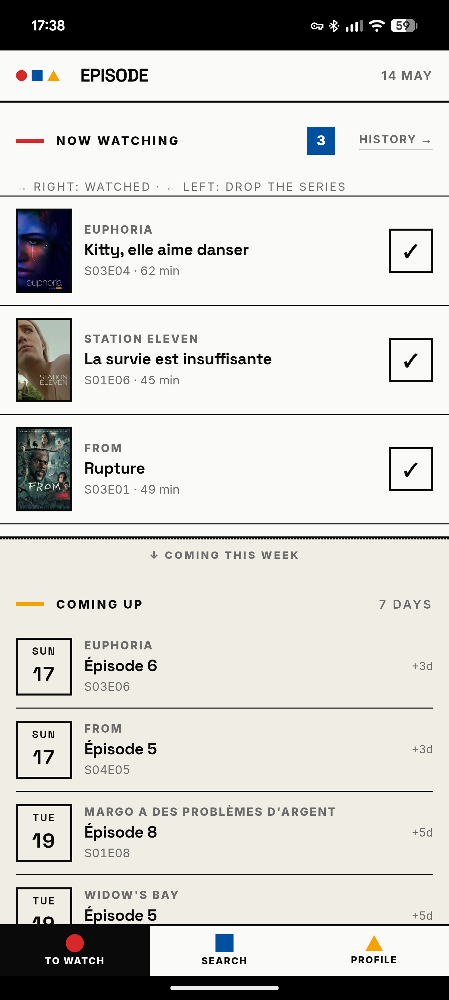
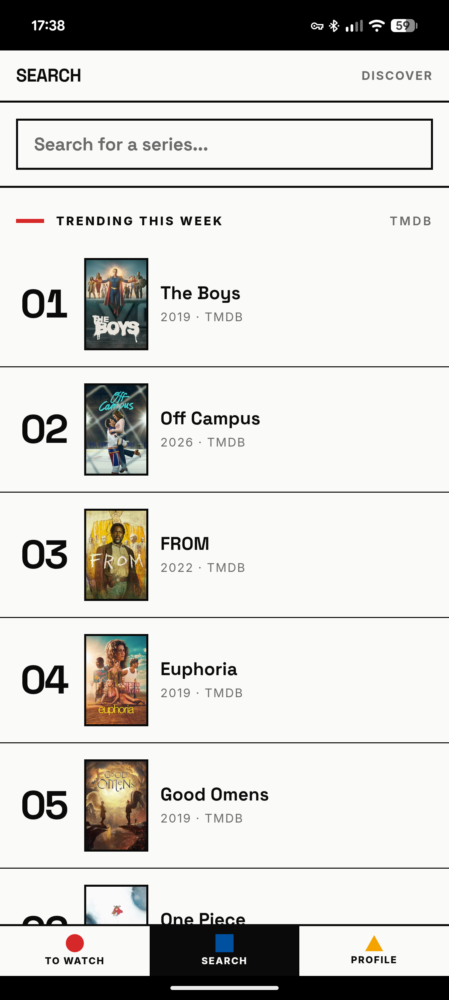
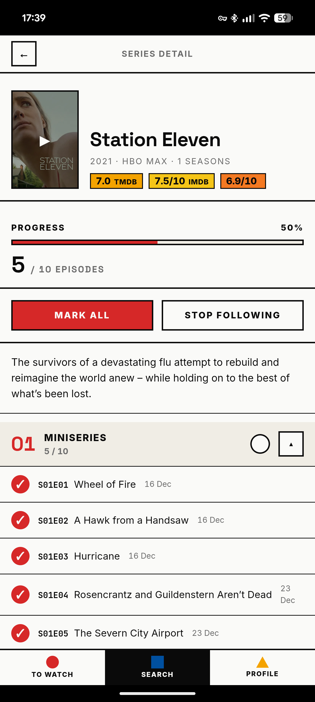
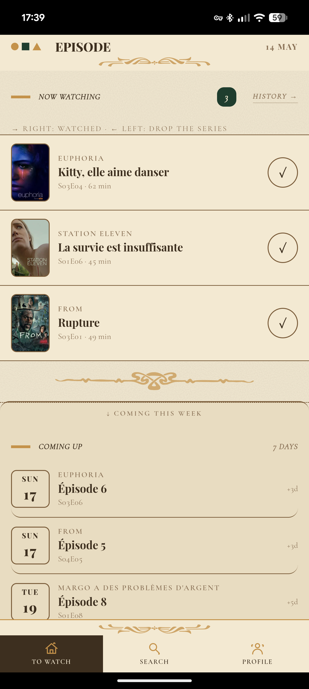

# Episode

Open-source TV series tracker — focused, mobile-first, self-hostable.

Episode is a lightweight alternative to TV Time, dedicated to **TV series only** — no movies, no social network, no recommendations. Your data stays with you, whether you self-host a Docker container or install a `.apk` on your phone.

---

## 📸 Screenshots

<p align="center">
  
  
  
  
</p>

<p align="center"><a href="screenshots/"><sub>📂 See all screenshots →</sub></a></p>

> GitHub opens any thumbnail in a lightbox when you click it — tap each one to inspect at full resolution.

---

## 🚀 Quick start

Two ways to run Episode. Pick one — or both.

### 🐳 Self-host (Docker)

```bash
git clone https://github.com/johanjudai/episode.git
cd episode
docker compose up -d --build
```

Episode is now live on **http://localhost:3000**. The container builds, runs the full test suite as a hard gate, then starts a Node server that persists everything to a named volume.

Put it behind Caddy/Traefik for HTTPS + auth → [full guide below](#self-hosting-docker-homelab).

### 📱 Android (APK)

Grab the latest release from
**[github.com/johanjudai/episode/releases/latest](https://github.com/johanjudai/episode/releases/latest)**
and sideload the `.apk` on your phone (Settings → Apps → _Install unknown apps_ → allow your file manager / browser).

The APK is fully offline — no server, no account, everything lives on the device. Built and signed automatically on every version tag.

→ Build yourself: [Android APK guide](#android-apk-local-target).

---

## Features

- **À voir** — episodes that have already aired, ready to mark watched
- **À venir** — upcoming episodes for the next 7 days
- Swipe right to mark watched, swipe left to remove a series (with confirmation)
- **Recherche** — TMDB-powered, with weekly trending shown by default
- **Fiche série** — seasons & episodes, bulk-tick a season or the entire series
- **Profil** — total watch time, episodes watched, recent history
- **Paramètres** — import TV Time export, TMDB API key, light/dark theme, accessibility (reduced motion, high contrast, text size)
- Onboarding on first launch (name, avatar, optional import)
- Bauhaus-inspired design with light and dark themes

## Two build targets, one codebase

| Target                   | Adapter          | Storage                                        | Use case                                                                                                         |
| ------------------------ | ---------------- | ---------------------------------------------- | ---------------------------------------------------------------------------------------------------------------- |
| **`server`** _(default)_ | `adapter-node`   | `better-sqlite3` file on the host              | Docker / homelab. PWA install on your phone for a native-feel experience over HTTPS.                             |
| **`local`**              | `adapter-static` | `sql.js` (WASM) → IndexedDB / Capacitor SQLite | Pure SPA. Wrapped by Capacitor into an Android `.apk` — everything (including the database) lives on the device. |

A single set of queries lives under `src/lib/data/` and takes a Drizzle handle as its first argument, so the same business logic runs against either driver. The split is just at the storage seam.

## Tech stack

- **SvelteKit 5** + **TypeScript** — server endpoints in `server` target, pure SPA in `local`
- **Drizzle ORM** — schema and queries shared by both drivers
- **better-sqlite3** (server target) and **sql.js + idb** (local target) — synchronous SQLite both sides
- **Zod** — runtime validation of TMDB responses and TV Time imports
- **TMDB API** — series metadata (user provides their own key)
- **Vitest** — unit + integration tests; the integration suite runs against BOTH drivers
- **Capacitor 6** — APK wrapping (Android only for now)
- **Playwright** — end-to-end tests

## Quickstart (development)

```bash
cp .env.example .env
npm install
npm run db:generate   # generate initial Drizzle migration from schema
npm run db:migrate    # apply to local SQLite file
npm run dev
```

Open http://localhost:5173 — on first visit you will be redirected to onboarding.

## Tests

```bash
npm run test:unit          # vitest, watch mode
npm run test:unit -- --run # one-shot run (CI + prebuild)
npm run test:e2e           # playwright
npm run coverage           # coverage report
```

> **Hard gate**: `npm run build` runs `prebuild` which runs the unit-test suite. **If any test fails, the build does not produce an artifact.** The query + mutation integration tests run twice (once per driver), so any divergence between better-sqlite3 and sql.js is caught immediately.

## Self-hosting (Docker, homelab)

This is the `server` target. The Dockerfile already builds with the right configuration.

### 1. Clone and configure

```bash
git clone https://github.com/johanjudai/episode.git
cd episode
cp .env.example .env
# edit .env — at minimum set EPISODE_ORIGIN to the URL you'll access from
```

`.env` example for a homelab behind a reverse proxy at `https://episode.home.lan`:

```env
EPISODE_ORIGIN=https://episode.home.lan
EPISODE_TMDB_API_KEY=               # optional — can also be set in /settings
```

### 2. Build and run

```bash
docker compose up -d --build
```

The first build takes ~2-4 minutes — it installs deps, **runs the full test suite (hard gate)**, then builds the SvelteKit bundle. If any test fails the image is not produced.

Episode is now serving on `http://<homelab-ip>:3000`. The container runs migrations automatically on every start, then launches the Node server.

### 3. Put it behind HTTPS

PWA install on mobile **requires HTTPS** (Chrome refuses to install a non-secure origin). Easiest setup with Caddy on the homelab:

```caddy
episode.home.lan {
  reverse_proxy 127.0.0.1:3000
}
```

### 4. Backup

The SQLite database is in the `episode-data` named volume.

```bash
docker run --rm -v episode_episode-data:/data -v $(pwd):/backup \
  alpine tar czf /backup/episode-backup-$(date +%F).tar.gz -C /data .
```

### Updating

```bash
git pull
docker compose up -d --build
```

Migrations run automatically on every container start.

## Android APK (local target)

This is the `local` target — everything (queries, mutations, TMDB calls) runs in the WebView. There is no server, no network, no auth. Persistent storage is IndexedDB inside the Capacitor app, scoped to the app's sandbox.

### 1. Build the SPA

```bash
npm run build:local    # produces build/ — a static SPA with sql.js bundled
```

### 2. Android setup

The `android/` Gradle project is committed to the repo (only the source skeleton — generated files are gitignored), so a fresh clone is ready to build. You just need a working Android SDK and a JDK 17+. Then:

```bash
npm run cap:sync       # build:local + copy build/ into android/app/.../public
```

Two ways to produce the APK from there:

**a) GUI** — open in Android Studio:

```bash
npm run cap:open:android
```

Then **Build → Generate Signed Bundle / APK** to produce a `.apk` you can sideload, or **Run** to deploy to a connected phone.

**b) CLI** — straight from the terminal (Windows PowerShell):

```powershell
cd android
.\gradlew.bat assembleDebug
```

The APK lands at `android/app/build/outputs/apk/debug/app-debug.apk` (~4 MB).

### Install on a phone

```bash
adb install android/app/build/outputs/apk/debug/app-debug.apk
```

(Requires USB debugging enabled on the phone. `adb` ships with the Android SDK's `platform-tools`.)

### Subsequent updates

```bash
npm run cap:sync           # rebuild + sync
cd android && .\gradlew.bat assembleDebug
```

### Where is the data?

- In development: IndexedDB store named `episode`, key `db` — a Uint8Array snapshot of the full SQLite file.
- In the APK: same IndexedDB, but it lives in the app's private storage area (`/data/data/fr.iagona.episode/`). Uninstalling the app removes it.

## TMDB API key

You need a free TMDB v3 API key:

1. Sign up at <https://www.themoviedb.org>
2. Request a key at <https://www.themoviedb.org/settings/api>
3. Paste it in **Paramètres → API TMDB**
   - In `server` target you can also pre-seed it via `EPISODE_TMDB_API_KEY`.
   - In `local` target the key is stored client-side in the local DB (settings table).

## Project structure

```
src/
├── app.css                       Design system (Bauhaus tokens, components)
├── app.html                      HTML shell (placeholders replaced at build/run)
├── hooks.server.ts               Onboarding redirect (server target only; neutered for local)
├── lib/
│   ├── api.ts                    Unified mutation facade — server target POSTs JSON,
│   │                             local target calls the data layer directly
│   ├── config.ts                 TARGET resolution (Vite define)
│   ├── db.ts                     Browser DB factory (local target)
│   ├── db.browser.ts             sql.js + IndexedDB driver
│   ├── local-sync.ts             Client-side TMDB sync wrapper (reads key from local DB)
│   ├── server/
│   │   └── db.ts                 better-sqlite3 driver — server target only
│   ├── data/                     PORTABLE — works in Node and browser
│   │   ├── schema.ts             Drizzle schema (single source of truth)
│   │   ├── db-types.ts           Portable `Db` type (BaseSQLiteDatabase<'sync', …>)
│   │   ├── queries.ts            Read-side queries, take `Db` as 1st arg
│   │   ├── mutations.ts          Write-side ops, take `Db` as 1st arg
│   │   ├── sync.ts               TMDB → DB sync helpers
│   │   ├── tmdb.ts               Typed TMDB client (Zod-validated)
│   │   ├── tvtime-import.ts      TV Time JSON parser
│   │   └── migrations.ts         Embedded SQL for the browser driver
│   ├── components/               Reusable UI (Mark, BottomNav, EpisodeRow, AvatarPicker)
│   ├── actions/                  Svelte actions (swipe)
│   └── utils/                    Date, format, theme, image helpers (pure)
└── routes/
    ├── +layout.svelte            Root layout + theme bootstrap
    ├── +layout.ts                ssr/prerender toggle per target + onboarding guard
    ├── +layout.server.ts         Onboarding flag (server target)
    ├── +page.{ts,server.ts,svelte}  "À voir" home
    ├── onboarding/               First-launch form
    ├── search/                   TMDB search + trending
    ├── series/[id]/              Series detail + bulk tick
    ├── profile/                  Stats + history
    ├── history/                  Full watch history
    ├── settings/                 Profile, TMDB key, import, theme, a11y
    └── api/                      Mutation endpoints called by `$lib/api` (server target)
        ├── episodes/{mark,unmark}/+server.ts
        ├── series/{follow,unfollow,mark-episode,mark-season,mark-all}/+server.ts
        ├── profile/{name,avatar}/+server.ts
        ├── settings/tmdb-key/+server.ts
        ├── onboarding/complete/+server.ts
        └── import/tvtime/+server.ts

drizzle/                          drizzle-kit generated migrations (server target)

tests/
├── unit/                         Vitest specs for pure modules
└── integration/                  Query / mutation suite — runs on BOTH drivers

capacitor.config.ts               Android wrapping (Capacitor 6)
android/                          (Created by `npx cap add android` — gitignored)
mockups/                          Static HTML/CSS wireframes (design source)
```

## Security & trust model

Episode is a **single-user, no-auth** app by design — there's no login, no
account, no per-user data partitioning. The threat model assumes that anyone
who can reach the running instance is _you_.

**Server target (Docker / homelab)**

- Do **not** expose port 3000 directly to the internet. The recommended
  setup is to put Episode behind a reverse proxy (Caddy, Traefik, nginx)
  that:
  - terminates TLS,
  - enforces some kind of access control (basic auth, OAuth proxy,
    Tailscale-only, your VPN of choice).
- The Node process runs as a non-root user inside the container and
  the SQLite file lives on a named volume — nothing else is mounted.
- The server sets defence-in-depth headers on every response:
  `Content-Security-Policy`, `X-Frame-Options: DENY`,
  `X-Content-Type-Options: nosniff`, `Referrer-Policy:
strict-origin-when-cross-origin`, and a `Permissions-Policy` that
  disables every browser API Episode never uses (camera, mic,
  geolocation, payment, USB, sensors).
- A per-IP token-bucket rate limiter (60 burst, 1 req/s sustained)
  protects every `/api/*` route from brute-force and from amplifying
  abuse against TMDB / OMDb quotas.
- All API endpoints validate inputs through Zod. The DB layer is
  Drizzle ORM (parameterised queries everywhere — no SQL string
  concatenation).
- TMDB / OMDb keys are stored in the SQLite settings table; they are
  **never** returned in load functions (only a `hasKey: boolean`).
- The TV Time import is capped at 50 MB at the application layer (see
  `MAX_UPLOAD_BYTES` in `src/routes/api/import/tvtime/+server.ts`).
  Note that the generic `BODY_SIZE_LIMIT` env var defaults to 512 KB
  and **must** be raised (to ≥ `52428800`) before any TV Time upload
  larger than 512 KB can actually reach the endpoint.

**Local target (Capacitor APK)**

- No server, no network listener. The only attack surface is the data
  the app makes outbound to TMDB / OMDb / TVMaze / Jikan, all of which
  are validated by Zod schemas before use.
- IndexedDB is sandboxed to the app's private storage area
  (`/data/data/fr.iagona.episode/`). Uninstalling the app wipes it.
- The TMDB / OMDb keys live in that same IndexedDB. They are _not_
  encrypted at rest — if an attacker has filesystem access (rooted
  device + ADB), they can read them. Treat them as low-sensitivity
  third-party API credentials, not user passwords.
- Capacitor config has `allowMixedContent: false` and
  `webContentsDebuggingEnabled: false`; the WebView only loads bundled
  assets.

**Both targets**

- TMDB image paths flow through a regex whitelist in
  `$lib/utils/images.ts` before being inlined into CSS
  `background-image: url(...)` — guards against an upstream
  compromise injecting CSS / script.
- The avatar upload accepts only `data:image/(png|jpeg|webp);base64,…`
  (no SVG, no remote URL).
- All third-party HTTPS endpoints we hit (TMDB, OMDb, TVMaze, Jikan)
  are wrapped with a Zod schema; any unexpected response shape is
  rejected at parse-time.

If you find a security issue, please open a GitHub issue
(<https://github.com/johanjudai/episode/issues>) — or, if it's
sensitive, get in touch directly.

## Releasing

The release flow (tag a version, build the signed APK, publish a GitHub Release) is documented in [`docs/RELEASING.md`](./docs/RELEASING.md). It's the maintainer's checklist — you don't need it as a user.

## Roadmap

- [ ] Signed release APK + Play Store / F-Droid listing (debug-signed today, sideload-only)
- [ ] iOS Capacitor wrapping (currently Android-only)
- [ ] Optional `@capacitor-community/sqlite` driver for native storage on Android (sql.js + IndexedDB works today, but native is faster)
- [ ] Background TMDB sync (refresh series airing status)
- [ ] Trakt OAuth import (cleaner than TV Time scraping, real public API)
- [ ] Optional password protection for self-host
- [ ] Pre-generated PNG icons for the manifest

## License

MIT — see [`LICENSE`](./LICENSE).
